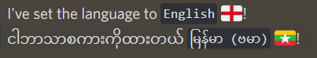

# Auto Translation Extension for [PyCord](https://github.com/Pycord-Development/pycord)


<a herf="https://discord.gg/UmnzdPgn6g"></a>
<a herf="https://github.com/Pycord-Development/pycord"></a>


## Key Features

- Automatic message, embed, button select langauge translations
- No code changes necessary
- Fully customizable
- Forward Compatible

Essentially, the extension is able to automatically translate all
specified objects [here](#fields-covered-by-automatic-translation) into any registered language
depending on the preferences of the channel or guild that the object
is getting sent to. For instance, if a channel has the preference for Spanish, any text being sent to the channel will be automatically translated into Spanish before it is sent.

Translations carry over formatting as much as possible.
<br>
_GoogleTranslated string in a different language with formatting maintaing_

Check out the [FAQ](#features-extended--faq) for more information.
This extension is relatively new, therefore please report any bugs at [issues](https://github.com/Rickaym/discord-ext-i18n/issues).

## Fields Covered by Automatic Translation

- `Messages`
- `Interaction Messages`
- `Embeds`
- `Buttons`
- `Selects`
- `Modals` (buggy)

## Installing

This is an extension for `PyCord`. It is recommended that there exists an installation of `py-cord>=2.0.0`.

To install this extension, run the following command:

```
# Linux/macOS
python3 -m pip install -U discord-ext-i18n

# Windows
py -3 -m pip install -U discord-ext-i18n
```

## Quick Example

**Required Steps**:

- Define a language getter function by decorating it with the
  `discord.ext.i18n.preprocess.Detector.language_getter` decorator
  (this getter is called with an ID of _guilds / channels_ to see if it has a
  language preference)
- Instantiate a `discord.ext.i18n.Agent` class (this is where injection occur)
- Make a command so that users can set preferences

```py
from typing import Optional
from discord.ext import commands
from discord import Intents
from discord.ext.i18n import Agent, Language, Detector

intents = Intents.default()
# not necessary for the extension, enabled for msg commands
intents.messages = True
intents.message_content = True

bot = commands.Bot(
    command_prefix="!",
    intents=intents,
)
bot.preferences = {}
bot.agent = Agent(translate_all=True)  # This must be instantiated at least and only once


@Detector.lang_getter
async def get_lang(id) -> Optional[Language]:
    """
    This decorated function will be called internally to get Language
    preferences.
    """
    return bot.preferences.get(id, None)


@bot.command(name="lang")
async def set_lang(ctx, lang_code):
    lang = Language.from_code(lang_code)
    if lang is None:
        return await ctx.reply("Bad language code!")
    else:
        # Set a language preference to the current channel.
        bot.preferences[ctx.channel.id] = lang
        await ctx.reply(f"I've set the language to `{lang.name.title()}` {lang.emoji}!")


@bot.command(name="hi")
async def greet(ctx):
    # This will be translated before sent if necessary
    await ctx.reply("Hey!!")


bot.run(...)
```

## Features Extended & FAQ

1. [How do we tell the extension to translate x?](#how-do-we-tell-the-extension-to-translate-x)
2. [How does the extension work?](#how-does-the-extension-work)
3. [What does it use to translate the string?](#what-does-it-use-to-translate-the-string)
4. [When are strings not translated?](#when-are-strings-not-translated)

### How do we tell the extension to translate x?

Generally, the extension will translate all messages. If you want
it to translate other things such as buttons, embeds and so on, you will have
to explicitly specify them as parameters when instantiating the `Agent` class or modify the
`translate_x` flag from the class. See detailed examples [here](./examples/settings)

Apart from that, you can call the usual methods like `Messegable.send`,
`ApplicationContext.respond` with your texts and the translation will be
handled in the backend. Absolutely
no code change is necessary when calling these high-level methods. Check out the many examples to see specific cases.

### How does the extension work?

When you call high-level methods e.g. `Messegable.send`
the extension intercepts the text and destination it's being sent to. It resolves
whether if this text requires translation by calling the language getter with the
ID of its destination. If it exists, it will append
the language code into an appropriate field. This appendage is later extracted
before text gets sent to the discord API where tokenization, translation, caching
and other book-keeping occurs if necessary.

### What does it use to translate the string?

By default, the extension translates your strings using the [Google Translator](https://pypi.org/project/googletrans/)
library. You can override this with your own translator like in the example
[here](./examples/modified_translator.py).

### When are strings not translated?

Obviously, the strings will not be translated if they're either already in
the language preferred by the destination or the destination has no preference.

---

#### TODO

[] Defer interaction responses only if translation doesn't exist in cache

Contributions are absolutely welcome, just create a pull-request and I'll merge them if reasonable.
